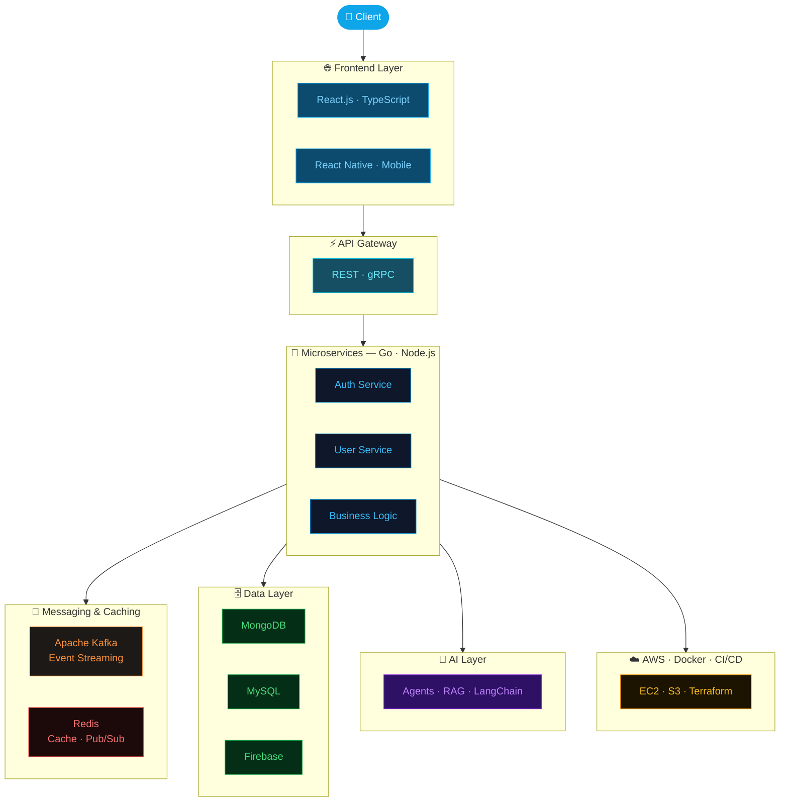

<div align="center">


<br/>

<a href="https://www.linkedin.com/in/awais-rasool713/"></a>&nbsp;
<a href="https://www.awaisrasool.tech/"></a>&nbsp;
<a href="https://x.com/ch_awais_rasool"></a>&nbsp;
<a href="mailto:ar30781871@gmail.com"></a>

<br/><br/>


<br/>


</div>

<br/>


## `$ whoami`

```typescript
const awais: Engineer = {
  location : "Lahore, Pakistan 🇵🇰",
  role     : "Full-Stack & Mobile Engineer",

  expertise: {
    frontend     : ["React.js", "TypeScript", "Redux", "Angular"],
    mobile       : ["React Native", "iOS & Android"],
    backend      : ["Go", "Gin", "Node.js", "Express.js"],
    architecture : ["Microservices", "Event-Driven", "REST APIs", "gRPC"],
    messaging    : ["Apache Kafka", "Redis Pub/Sub", "Message Queues"],
    caching      : ["Redis", "In-Memory Caching", "Session Management"],
    databases    : ["MongoDB", "MySQL", "Firebase", "Redis"],
    cloud        : ["AWS (S3, EC2)", "Docker", "Terraform", "CI/CD"],
  },

  currentFocus : "Agentic AI · LLM Systems · Scalable Microservices",
  exploring    : ["LangChain", "LangGraph", "AI Agents", "RAG", "Vector DBs"],
  openTo       : "Full-Stack · Mobile · AI · Distributed Systems",
};
```


## 🛠️ Tech Arsenal

<div align="center">

#### 🎨 Frontend


#### 📱 Mobile


#### ⚙️ Backend & Architecture


#### 📨 Messaging & Caching


#### 🗄️ Databases


-0f172a?style=for-the-badge&logo=redis&logoColor=FF4438)

#### ☁️ Cloud & DevOps


</div>


## 🤖 Currently Deep-Diving — AI & Agentic Systems

<div align="center">

<table>
<tr>
<td width="50%">

**🧠 AI & LLMs**
| Technology | Status |
|------------|--------|
| OpenAI API · Claude · Ollama | 🔥 Active |
| LangChain · LangGraph | 📖 Learning |
| Agentic Workflows · ReAct | 📖 Learning |
| RAG Pipelines · Vector DBs | 🌱 Exploring |
| Embeddings · Semantic Search | 🌱 Exploring |

</td>
<td width="50%">

**🏗️ Distributed Systems**
| Technology | Status |
|------------|--------|
| Apache Kafka · Event Streaming | 🔥 Active |
| Redis · Caching Strategies | 🔥 Active |
| Microservices Architecture | 🔥 Active |
| gRPC · Service Mesh | 📖 Learning |
| Terraform · IaC | 🌱 Exploring |

</td>
</tr>
</table>

</div>


## 🏗️ System Architecture




## 📊 GitHub Statistics

<div align="center">
  
  
</div>

<div align="center">
  
  
</div>

</div>


<div align="center">

<br/>

**`> open_to_work --type="Full-Stack | Mobile | AI | Microservices"`**

<sub>Lahore, Pakistan 🇵🇰 · Building distributed systems & AI-powered products</sub>

<br/>


</div>
