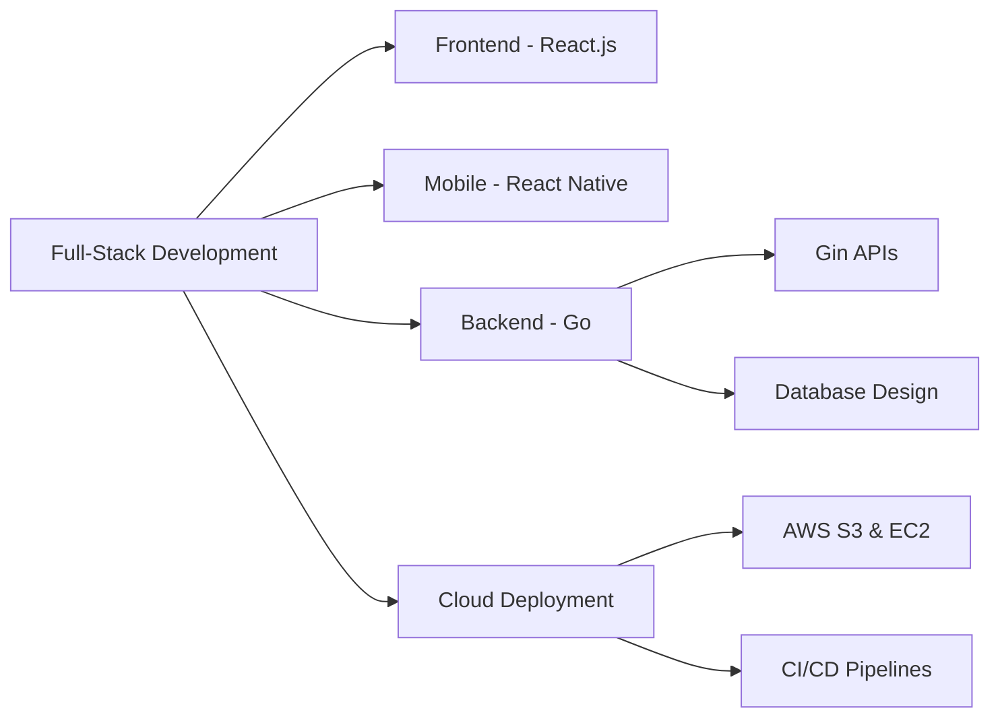

<div align="center">
  
</div>

<div align="center">
  
  ### 👨‍💻 Full-Stack Developer | 📱 Mobile App Developer | ☁️ Cloud Enthusiast
  
  
  
  <p align="center">
    
  </p>
  
</div>

---

### 🎯 About Me

```javascript
const awais = {
    location: "Lahore, Pakistan 🇵🇰",
    role: "Full-Stack Developer",
    expertise: {
        frontend: ["React.js", "React Native", "TypeScript", "Redux"],
        backend: ["Go","Gin","Node.js", "Express.js"],
        mobile: ["React Native", "Cross-platform Apps"],
        cloud: ["AWS (S3, EC2)", "CI/CD Pipelines"],
        databases: ["MongoDB", "MySQL", "Firebase"]
    },
    currentlyLearning: ["DevOps Automation"],
    workingOn: "Scalable Full-Stack & Mobile Applications",
    askMeAbout: ["React", "React Native", "Go", "Gin", "Node.js", "Express", "AWS Deployment"]
};
```

---

### 💼 What I Do Best

<div align="center">

| 🎨 Frontend | 📱 Mobile | ⚙️ Backend | ☁️ Cloud & Deployment |
|------------|----------|-----------|---------------------|
| React.js | React Native | Go | AWS (S3, EC2) |
| TypeScript | Cross-Platform | Gin | CI/CD Pipelines |
| Redux | Mobile Apps | REST APIs | Cloud Deployment |
| Responsive UI | iOS & Android | MongoDB | Server Management |

</div>

---

### 🌱 Currently Exploring

<div align="center">
  
| Technology | Purpose | Progress |
|------------|---------|----------|
| 🔧 **Terraform** | Infrastructure as Code | 🌱 Learning |

</div>

---

### 🌐 Connect With Me

<div align="center">
  
[](https://www.linkedin.com/in/awais-rasool713/)
[](https://www.awaisrasool.tech/)
[](https://x.com/ch_awais_rasool)
[](mailto:ar30781871@gmail.com)

</div>

---

### 💻 Tech Stack & Tools

<div align="center">

#### 🎨 Frontend Development


#### 📱 Mobile Development


#### ⚙️ Backend Development


#### 🗄️ Databases


#### ☁️ Cloud & DevOps


#### 💻 Programming Languages


</div>

---

### 🚀 My Expertise

<div align="center">



</div>

---

### 📊 GitHub Statistics

<div align="center">
  
  
</div>

<div align="center">
  
  
</div>

---

<div align="center">
  
  
  ### 💬 Let's Build Something Amazing Together!
  
  **Open to collaborating on Full-Stack & Mobile Development Projects**
  
  
  
</div>
